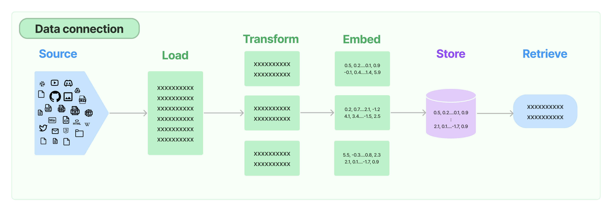

# Retrieval(检索):
- [Retrieval(检索):](#retrieval检索)
  - [Document loaders(文档导入):](#document-loaders文档导入)
  - [Text Splitting:](#text-splitting)
  - [Text embedding models](#text-embedding-models)
  - [Vector stores:](#vector-stores)
  - [Retrievers:](#retrievers)
  - [Indexing:](#indexing)

Many LLM applications require user-specific data that is not part of the model's training set. 

很多LLM应用需要用户特定的数据，而这些数据不在模型的训练集中。 

The primary way of accomplishing this is through Retrieval Augmented Generation (RAG). 

实现这一点的主要方式是通过检索增强生成（RAG）。 

In this process, external data is retrieved and then passed to the LLM when doing the generation step. 

在这个过程中，外部数据被检索然后传递给LLM进行生成步骤。 

LangChain provides all the building blocks for RAG applications - from simple to complex. 

LangChain提供了RAG应用所需的所有构建模块 - 从简单到复杂。 

This section of the documentation covers everything related to the retrieval step - e.g. the fetching of the data. 

本文档涵盖了与检索步骤相关的所有内容 - 例如，数据的获取。 

Although this sounds simple, it can be subtly complex. 

尽管听起来很简单，但可能会有微妙的复杂性。 

This encompasses several key modules. 

这包括几个关键模块。 

## Document loaders(文档导入):

**Document loaders** load documents from many different sources. 

文档加载器从许多不同的来源加载文档。 

LangChain provides over 100 different document loaders as well as integrations with other major providers in the space, like AirByte and Unstructured. 

LangChain提供了超过100种不同的文档加载器，以及与其他主要提供商（如AirByte和Unstructured）的集成。 

LangChain provides integrations to load all types of documents (HTML, PDF, code) from all types of locations (private S3 buckets, public websites). 

LangChain提供了加载所有类型文档（HTML、PDF、代码）的集成，可以从各种位置（私有S3存储桶、公共网站）加载。 

## Text Splitting:

A key part of retrieval is fetching only the relevant parts of documents. 

检索的关键是只检索文档的相关部分。 

This involves several transformation steps to prepare the documents for retrieval. 

这涉及几个转换步骤来准备文档进行检索。 

One of the primary ones here is splitting (or chunking) a large document into smaller chunks. 

其中一个主要步骤是将大型文档分割（或分块）成较小的片段。 

LangChain provides several transformation algorithms for doing this, as well as logic optimized for specific document types (code, markdown, etc). 

LangChain提供了几种转换算法来执行此操作，以及针对特定文档类型（代码、markdown等）进行优化的逻辑。 

## Text embedding models

Another key part of retrieval is creating embeddings for documents. 

检索的另一个关键部分是为文档创建嵌入。 

Embeddings capture the semantic meaning of the text, allowing you to quickly and efficiently find other pieces of a text that are similar. 

嵌入捕捉文本的语义含义，使您能够快速高效地找到其他类似的文本片段。 

LangChain provides integrations with over 25 different embedding providers and methods, from open-source to proprietary API, allowing you to choose the one best suited for your needs. 

LangChain提供了与超过25个不同的嵌入提供商和方法的集成，从开源到专有API，使您可以选择最适合您需求的方法。 

LangChain provides a standard interface, allowing you to easily swap between models. 

LangChain提供了一个标准接口，使您可以轻松地在模型之间进行切换。 

## Vector stores:

With the rise of embeddings, there has emerged a need for databases to support efficient storage and searching of these embeddings. 

随着嵌入的兴起，出现了对数据库支持这些嵌入的高效存储和搜索的需求。 

LangChain provides integrations with over 50 different vector stores, from open-source local ones to cloud-hosted proprietary ones, allowing you to choose the one best suited for your needs. 

LangChain提供了与超过50个不同的向量存储集成，从开源本地存储到云托管的专有存储，使您可以选择最适合您需求的方法。 

LangChain exposes a standard interface, allowing you to easily swap between vector stores. 

LangChain提供了一个标准接口，使您可以轻松地在向量存储之间进行切换。 

## Retrievers:

Once the data is in the database, you still need to retrieve it. 

一旦数据在数据库中，您仍然需要检索它。 

LangChain supports many different retrieval algorithms and is one of the places where we add the most value. 

LangChain支持许多不同的检索算法，这是我们增加最多价值的地方之一。 

LangChain supports basic methods that are easy to get started - namely simple semantic search. 

LangChain支持易于开始的基本方法 - 即简单的语义搜索。 

However, we have also added a collection of algorithms on top of this to increase performance. 

但是，我们还添加了一系列算法来提高性能。 

These include: 

- Parent Document Retriever: This allows you to create multiple embeddings per parent document, allowing you to look up smaller chunks but return larger context.

父文档检索器：这允许您为每个父文档创建多个嵌入，从而使您能够查找较小的块但返回较大的上下文。 

- Self Query Retriever: User questions often contain a reference to something that isn't just semantic but rather expresses some logic that can best be represented as a metadata filter. Self-query allows you to parse out the semantic part of a query from other metadata filters present in the query. 

自查询检索器：用户问题通常包含对不仅是语义的东西的引用，而是表达一些逻辑的东西，最好表示为元数据过滤器。 自查询允许您从查询中存在的其他元数据过滤器中解析出查询的语义部分。 

- Ensemble Retriever: Sometimes you may want to retrieve documents from multiple different sources, or using multiple different algorithms. The ensemble retriever allows you to easily do this.

整合检索器：有时您可能希望从多个不同的来源检索文档，或者使用多个不同的算法。 整合检索器使您可以轻松实现此目标。 

- And more! 还有更多！

## Indexing:

The LangChain Indexing API syncs your data from any source into a vector store, helping you: 

LangChain的索引API将您的数据从任何来源同步到向量存储中，帮助您： 

- Avoid writing duplicated content into the vector store. 避免将重复的内容写入向量存储。

- Avoid re-writing unchanged content. 避免重新编写未更改的内容。

- Avoid re-computing embeddings over unchanged content. 避免在未更改的内容上重新计算嵌入。

All of which should save you time and money, as well as improve your vector search results. 

所有这些都应该为您节省时间和金钱，同时改善您的向量搜索结果。 